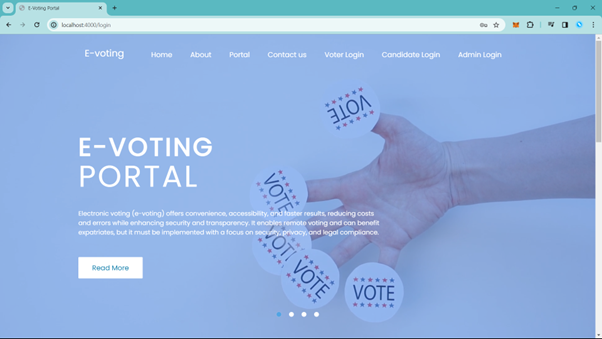
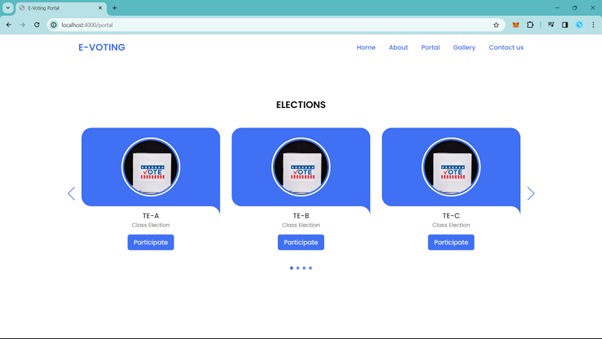
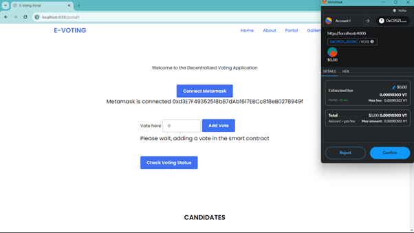
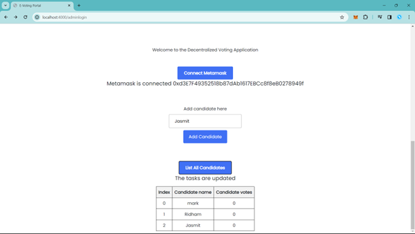

# 🗳️ E-Voting Portal

A secure and transparent **E-Voting Portal** designed using **Node.js**, **MongoDB**, and integrated with **Blockchain-like logic** to ensure tamper-proof and verifiable elections. This system is built to digitize the voting process while preserving voter confidentiality and vote integrity.

---

## 📌 Features

- 👤 User authentication for voters and administrators
- 🗳️ Cast vote securely with one-time access per voter
- 🔒 Votes recorded with hash-based encryption (blockchain simulation)
- 📊 Real-time vote counting dashboard for admin
- 🧾 Voter eligibility verification and vote status tracking
- 🛡️ Prevents duplicate voting using vote flags
- 📁 Voter and vote data stored securely in MongoDB

---

## 🛠️ Tech Stack

- **Frontend:** HTML, CSS, JavaScript (EJS/Handlebars if templating used)
- **Backend:** Node.js (Express.js)
- **Database:** MongoDB (Mongoose)
- **Blockchain Logic:** Custom block structure with chaining for votes

---

## 🚀 How to Run the Project

### ✅ Prerequisites

- Node.js installed
- MongoDB installed or access to MongoDB Atlas
- Git installed

### ▶️ Steps to Run

1. Clone this repository:
   ```bash
   https://github.com/ridhammm21/E-Voting-Portal.git
   cd E-Voting-Portal

## 📸 Screenshots

| Home Page | Portal Page |
|-----------|-------------|
|  |  |

| Voting Page | Admin Page |
|-------------|------------|
|  |  |

